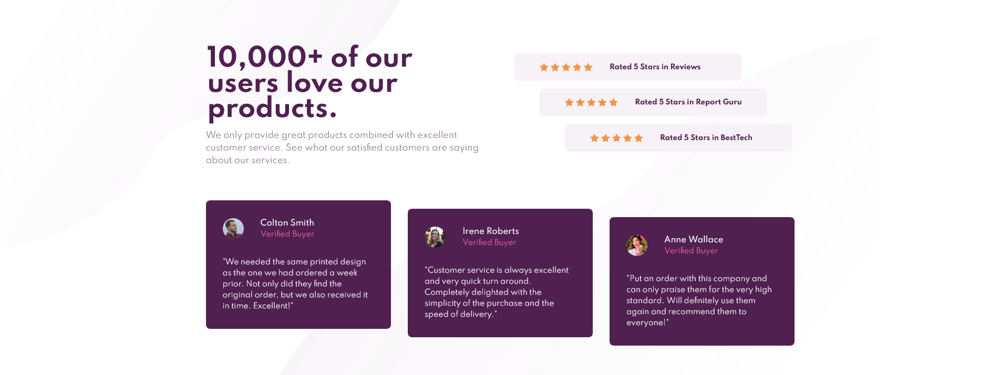

# Frontend Mentor - Social proof section solution

This is a solution to the [Social proof section challenge on Frontend Mentor](https://www.frontendmentor.io/challenges/social-proof-section-6e0qTv_bA). Frontend Mentor challenges help you improve your coding skills by building realistic projects. 

## Table of contents

- [Overview](#overview)
  - [The challenge](#the-challenge)
  - [Screenshot](#screenshot)
  - [Links](#links)
- [My process](#my-process)
  - [Built with](#built-with)
  - [What I learned](#what-i-learned)
  - [Useful resources](#useful-resources)
- [Author](#author)

## Overview

### The challenge

Users should be able to:

- View the optimal layout for the section depending on their device's screen size

### Screenshot

### Links

- GitHub repository: [This is the project repository](https://github.com/Shadowbest/social-proof-section)
- Live Site URL: [Add live site URL here](https://your-live-site-url.com)

## My process

### Built with

- Semantic HTML5 markup
- CSS custom properties
- Flexbox
- CSS Grid
- Mobile-first workflow

### What I learned

This was a fun challenge, a bit more complicated than I anticipated. Aligning the stars on desktop was somewhat complicted to achieve. I also learned more about accesibility and semantic HTML. I also learned that you can use more than one background image on an element and use other background properties for each one.

### Continued development

I'm still not quite sure how to position many background images, their size and position to better reflect the design. So I will have to keep studying to better comprehend them. And I still will keep reading on accessibility.

### Useful resources

- [Kevin Powell](https://www.youtube.com/kepowob) - Kevin Powell's youtube channel helped me on this one. I remembered once I saw him use different background images and could control the size and position of each one separately.
- [MDN](https://developer.mozilla.org/en-US/) - This website is very good for quick references on many HTML & CSS techniques.

## Author

- Frontend Mentor - [@Shadowbest](https://www.frontendmentor.io/profile/Shadowbest)
